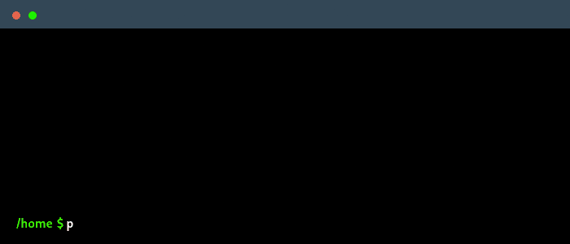

<h1 align="center">
  
  <br>
  Papeer
</h1>

<h4 align="center">Web scraper for ereaders</h4>

<p align="center">
  <a href="#features">Features</a> •
  <a href="#installation">Installation</a> •
  <a href="#how-to-use">How To Use</a>
</p>

  


## Features

* Scrape websites and RSS feeds
* Keep relevant content only
  - Formatted text (bold, italic, links)
  - Images
* Save websites as Markdown, HTML, EPUB or MOBI files
* Use it as a an HTTP proxy
* Cross platform
  - Windows, MacOS and Linux ready

# Installation

## From source

```sh
go install github.com/lapwat/papeer@latest
```

## From binary

Download [latest release](https://github.com/lapwat/papeer/releases/latest) for Windows, MacOS (darwin) and Linux.

## MOBI support

> Kindle e-readers now support EPUB format

Install kindlegen to export websites to Kindle compatible ebooks, Linux only.

```sh
TMPDIR=$(mktemp -d -t papeer-XXXXX)
curl -L https://github.com/lapwat/papeer/releases/download/kindlegen/kindlegen_linux_2.6_i386_v2_9.tar.gz > $TMPDIR/kindlegen.tar.gz
tar xzvf $TMPDIR/kindlegen.tar.gz -C $TMPDIR
chmod +x $TMPDIR/kindlegen
sudo mv $TMPDIR/kindlegen /usr/local/bin
rm -rf $TMPDIR
```

Now you can use `--format=mobi` in your `get` command.

## How To Use

### Scrape a single page

```sh
papeer get URL
```

The `get` command let's you retrieve the content of a web page.

It removes ads and menus with `go-readability`, keeping only formatted text and images.

You can chain URLs.

**Options**

```sh
-a, --author string      book author
-f, --format string      file format [md, html, epub, mobi] (default "md")
-h, --help               help for get
    --headless           use headless browser for JavaScript-rendered content
    --images             retrieve images only
-n, --name string        book name (default: page title)
    --output string      file name (default: book name)
    --stdout             print to standard output
```

### Scrape a whole website recursively

**Display the table of contents**

Before scraping a whole website, it is a good idea to use the `list` command. This command is like a _dry run_, **which lets you vizualize the content before retrieving it**.

You can use several options to customize the table of contents extraction, such as `selector`, `limit`, `offset`, `reverse` and `include`. Type `papeer list --help` for more information about those options.

The selector option should point to **`<a>` HTML tags**. If you don't specify it, the `selector` will be automatically determined based on the links present on the page.

```sh
papeer list https://12factor.net/ --selector='section.concrete>article>h2>a'
```

```
 #  NAME                    URL                                    
 1  I. Codebase             https://12factor.net/codebase          
 2  II. Dependencies        https://12factor.net/dependencies      
 3  III. Config             https://12factor.net/config            
 4  IV. Backing services    https://12factor.net/backing-services  
 5  V. Build, release, run  https://12factor.net/build-release-run 
 6  VI. Processes           https://12factor.net/processes         
 7  VII. Port binding       https://12factor.net/port-binding      
 8  VIII. Concurrency       https://12factor.net/concurrency       
 9  IX. Disposability       https://12factor.net/disposability     
10  X. Dev/prod parity      https://12factor.net/dev-prod-parity   
11  XI. Logs                https://12factor.net/logs              
12  XII. Admin processes    https://12factor.net/admin-processes
```

**Scrape the content**

Once you are satisfied with the table of contents listed by the `list` command, you can scrape the content of those pages with the `get` command. You can use the same options that you specified for the `list` command.

```sh
papeer get https://12factor.net/ --selector='section.concrete>article>h2>a'
```

```
[===>-----------------------------] Chapters 7 / 12
[=================================] 1. I. Codebase
[=================================] 2. II. Dependencies
[=================================] 3. III. Config
[=================================] 4. IV. Backing services
[=================================] 5. V. Build, release, run
[=================================] 6. VI. Processes
[=================================] 7. VII. Port binding
[---------------------------------] 8. VIII. Concurrency
[---------------------------------] 9. IX. Disposability
[---------------------------------] 10. X. Dev/prod parity
[---------------------------------] 11. XI. Logs
[---------------------------------] 12. XII. Admin processes
Markdown saved to "The_Twelve-Factor_App.md"
```

**Recursive mode options**

If a navigation menu is present on a website, you can scrape the content of each subpage.

You can activate this mode by using the `depth` or `selector` options.

**`depth`**

This option defaults to 0, `papeer` will grab only the main page.

This option defaults to 1 if the `limit` option is specified.

If you specify a value greater than 0, `papeer` will grab pages as deep as the value you specify.

**`selector`**

If this option is not specified, `papeer` will grab only the one page.

If this option is specified, `papeer` will select the links (a HTML tag) present on the main page, then grab each one of them.

You can chain this option to grab several level of pages with diferent selectors for each level.

**`include`**

Using this option will include all intermediary levels into the book.

**`delay` `threads`**

By default, it will grab all the pages asynchonously.

Use those options to tweak the synchronicity of scrape requests.

**`headless`**

Some websites use JavaScript to render their content, including navigation menus. Use this option to enable a headless browser for scraping JavaScript-rendered content.

```sh
papeer get https://my-js-website.com/ --headless --selector="nav.sidebar a" --format=epub
```

This is particularly useful for websites like the Rust Programming Language book, where the navigation sidebar is rendered using JavaScript.

**Automatic table of contents extraction**

If you have a `depth` greater than 1 with no `selector`, it will be automatically determined based on the links present on the parent page.

# Proxy

You can use the `proxy` command to act like proxy. It can serve HTML or Markdown content based on the `--output` option.

```sh
papeer proxy --output=md
# Proxy listening on port 8080...
```

You can call the endpoint with `curl` and the `--proxy` option.

```sh
curl --insecure --location --proxy localhost:8080 http://www.brainjar.com/java/host/test.html
# This is a very simple HTML file.
```

# Autocompletion

Execute this command in your current shell, or add it to your `.bashrc`.

```sh
. <(papeer completion bash)
```

You can replace `bash` by your own shell (zsh, fish or powershell).

Type `papeer completion bash -h` for more information.

# Dependencies

- `cobra` command line interface
- `go-readability` extract content from HTML
- `html-to-markdown` convert HTML to Markdown
- `go-epub` convert HTML to EPUB
- `colly` query HTML trees
- `uiprogress` display progress bars
